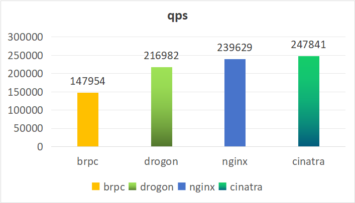

# 基于C++20 协程的http 库--cinatra

<!-- vscode-markdown-toc -->
* 1. [benchmark result](#benchmarkresult)
* 2. [基本http 请求](#http)
	* 2.1. [启动http服务器](#http-1)
	* 2.2. [client 发请求](#client)
	* 2.3. [restful api](#restfulapi)
	* 2.4. [https 访问](#https)
* 3. [websocket](#websocket)
* 4. [静态文件服务](#)
* 5. [反向代理](#-1)
	* 5.1. [先启动3个被代理的服务器](#3)
	* 5.2. [启动代理服务器](#-1)
	* 5.3. [client 请求代理服务器](#client-1)
* 6. [增加切面](#-1)
	* 6.1. [创建任意切面](#-1)
	* 6.2. [应用切面](#-1)
* 7. [chunked、ranges、multipart](#chunkedrangesmultipart)
	* 7.1. [chunked 上传下载](#chunked)
	* 7.2. [ranges 下载](#ranges)
	* 7.3. [multipart 上传下载](#multipart)
* 8. [benchmark code](#benchmarkcode)
	* 8.1. [brpc http benchmark code](#brpchttpbenchmarkcode)
	* 8.2. [drogon benchmark code](#drogonbenchmarkcode)
	* 8.3. [nginx http配置](#nginxhttp)
	* 8.4. [cinatra benchmark code](#cinatrabenchmarkcode)

<!-- vscode-markdown-toc-config
	numbering=true
	autoSave=true
	/vscode-markdown-toc-config -->
<!-- /vscode-markdown-toc -->

# 基于C++20 协程的http 库--cinatra

cinatra是基于C++20 无栈协程实现的跨平台、header only、高性能、易用的http/https库(http1.1)，包括http server和http client，功能完备，不仅仅支持最普通的get post 等请求，还支持restful api, websocket、chunked、ranges、multipart、静态文件服务和反向代理等功能。后面会分别介绍这些功能，文末也会附上benchmark测试代码。

##  1. <a name='benchmarkresult'></a>benchmark result

测试方法：使用wrk相同的参数(```./wrk -t4 -c240 -d35s http://127.0.0.1:9001/plaintext```)测试，服务端返回的内容相同。

```
HTTP/1.1 200 OK\r\nContent-Length: 13\r\nContent-Type: text/plain\r\nDate: Wed, 21 Feb 2024 09:46:18 GMT\r\nServer: xxx\r\n\r\nHello, World!
```

在4核2.3G主频的ubuntu 云主机上测试，gcc11，开启-O3优化。

qps结果：

```
brpc:    147954
drogon:  216982
nginx:   239629
cinatra: 247841
```



##  2. <a name='http'></a>基本http 请求
###  2.1. <a name='http-1'></a>启动http服务器
```c++
#include <include/cinatra.hpp>
using namespace cinatra;

void start_server() {
  coro_http_server server(/*thread_num = */std::thread::hardware_concurrency(), 9001);
  server.set_http_handler<GET>(
      "/", [](coro_http_request &req, coro_http_response &resp) {
        resp.set_status_and_content(status_type::ok, "ok"); // response in io thread
      });

  server.set_http_handler<GET, POST>(
      "/in_thread_pool",
      [](coro_http_request &req,
         coro_http_response &resp) -> async_simple::coro::Lazy<void> {
        //respose in thread pool.
        co_await coro_io::post([&] {
          resp.set_status_and_content(status_type::ok, "ok in thread pool");
        });
      });
   server.sync_start();
}
```
几行代码即可创建一个http服务，先设置http server工作线程数和端口。然后设置http服务的url，http method和对应的处理函数。可以在io线程或者线程池中去处理http请求。

###  2.2. <a name='client'></a>client 发请求
```c++
#include <include/cinatra.hpp>
using namespace cinatra;

async_simple::coro::Lazy<void> do_request() {
  coro_http_client client{};
  auto result = co_await client.async_get("http://127.0.0.1:9001/");
  assert(result.status == 200);
  assert(result.resp_body == "ok");
  for (auto [key, val] : result.resp_headers) {
    std::cout << key << ": " << val << "\n";
  }

  result = co_await client.async_get("/in_thread_pool");
  assert(result.status == 200);
}
```
http client 异步请求服务器，返回结果中包括服务端响应的状态码、http content以及http 头，如果发生网络错误，可以从result.net_err 中拿到错码和错误message。

###  2.3. <a name='restfulapi'></a>restful api

```c++
  coro_http_server server(/*thread_num = */std::thread::hardware_concurrency(), 9001);
  server.set_http_handler<cinatra::GET, cinatra::POST>(
      "/test2/{}/test3/{}",
      [](coro_http_request &req,
         coro_http_response &resp) -> async_simple::coro::Lazy<void> {
        co_await coro_io::post([&]() {
          CHECK(req.matches_.str(1) == "name");
          CHECK(req.matches_.str(2) == "test");
          resp.set_status_and_content(cinatra::status_type::ok, "hello world");
        });
        co_return;
      });

  server.set_http_handler<cinatra::GET, cinatra::POST>(
      R"(/numbers/(\d+)/test/(\d+))",
      [](coro_http_request &req, coro_http_response &response) {
        CHECK(req.matches_.str(1) == "100");
        CHECK(req.matches_.str(2) == "200");
        response.set_status_and_content(status_type::ok, "number regex ok");
      });

  server.set_http_handler<cinatra::GET, cinatra::POST>(
      "/user/:id", [](coro_http_request &req, coro_http_response &response) {
        CHECK(req.params_["id"] == "cinatra");
        response.set_status_and_content(status_type::ok, "ok");
      });

  server.set_http_handler<cinatra::GET, cinatra::POST>(
      "/user/:id/subscriptions",
      [](coro_http_request &req, coro_http_response &response) {
        CHECK(req.params_["id"] == "subid");
        response.set_status_and_content(status_type::ok, "ok");
      });

  server.set_http_handler<cinatra::GET, cinatra::POST>(
      "/values/:x/:y/:z",
      [](coro_http_request &req, coro_http_response &response) {
        CHECK(req.params_["x"] == "guilliman");
        CHECK(req.params_["y"] == "cawl");
        CHECK(req.params_["z"] == "yvraine");
        response.set_status_and_content(status_type::ok, "ok");
      });
  server.async_start();

  coro_http_client client;
  client.get("http://127.0.0.1:9001/test2/name/test3/test");
  client.get("http://127.0.0.1:9001/numbers/100/test/200");

  client.get("http://127.0.0.1:9001/user/cinatra");
  client.get("http://127.0.0.1:9001/user/subid/subscriptions");
  client.get("http://127.0.0.1:9001/value/guilliman/cawl/yvraine");    
```

###  2.4. <a name='https'></a>https 访问
```c++
#ifdef CINATRA_ENABLE_SSL
  coro_http_client client{};
  result = co_await client.async_get("https://www.taobao.com");
  assert(result.status == 200);
#endif
```
访问https网站时，确保已经安装了openssl并开启了ENABLE_SSL。

##  3. <a name='websocket'></a>websocket
```c++
  cinatra::coro_http_server server(1, 9001);
  server.set_http_handler<cinatra::GET>(
      "/ws_echo",
      [](cinatra::coro_http_request &req,
         cinatra::coro_http_response &resp) -> async_simple::coro::Lazy<void> {
        cinatra::websocket_result result{};

        while (true) {
          result = co_await req.get_conn()->read_websocket();
          if (result.ec) {
            break;
          }

          if (result.type == cinatra::ws_frame_type::WS_CLOSE_FRAME) {
            REQUIRE(result.data == "test close");
            break;
          }

          auto ec = co_await req.get_conn()->write_websocket(result.data);
          if (ec) {
            break;
          }
        }
      });
  server.sync_start();
```
在协程处理函数中，while循环异步读写websocket数据。

client端：
```c++
  cinatra::coro_http_client client{};
  std::string message(100, 'x');

  co_await client.connect("ws://127.0.0.1:9001/ws_echo");
  co_await client.write_websocket(std::string(message));
  auto data = co_await client.read_websocket();
  CHECK(data.resp_body == message);
  co_await client.write_websocket_close("test close");
  data = co_await client.read_websocket();
  CHECK(data.resp_body == "test close");
  CHECK(data.net_err == asio::error::eof);
```
client 设置读回调和close回调分别处理收到的websocket 消息和websocket close消息。

##  4. <a name=''></a>静态文件服务
```c++
  std::string filename = "temp.txt";
  create_file(filename, 64);

  coro_http_server server(1, 9001);

  std::string virtual_path = "download";
  std::string files_root_path = "";  // current path
  server.set_static_res_dir(
      virtual_path,
      files_root_path);  // set this before server start, if you add new files,
                         // you need restart the server.
  server.async_start();

  coro_http_client client{};
  auto result =
      co_await client.async_get("http://127.0.0.1:9001/download/temp.txt");
  assert(result.status == 200);
  assert(result.resp_body.size() == 64);
```
服务端设置虚拟路径和实际的文件路径，下载文件时输入虚拟路径和实际路径下的文件名即可实现下载。

##  5. <a name='-1'></a>反向代理
假设有3个服务器需要代理，代理服务器根据负载均衡算法来选择其中的一个来访问并把结果返回给客户端。

###  5.1. <a name='3'></a>先启动3个被代理的服务器
```c++
  cinatra::coro_http_server web_one(1, 9001);

  web_one.set_http_handler<cinatra::GET, cinatra::POST>(
      "/",
      [](coro_http_request &req,
         coro_http_response &response) -> async_simple::coro::Lazy<void> {
        co_await coro_io::post([&]() {
          response.set_status_and_content(status_type::ok, "web1");
        });
      });

  web_one.async_start();

  cinatra::coro_http_server web_two(1, 9002);

  web_two.set_http_handler<cinatra::GET, cinatra::POST>(
      "/",
      [](coro_http_request &req,
         coro_http_response &response) -> async_simple::coro::Lazy<void> {
        co_await coro_io::post([&]() {
          response.set_status_and_content(status_type::ok, "web2");
        });
      });

  web_two.async_start();

  cinatra::coro_http_server web_three(1, 9003);

  web_three.set_http_handler<cinatra::GET, cinatra::POST>(
      "/", [](coro_http_request &req, coro_http_response &response) {
        response.set_status_and_content(status_type::ok, "web3");
      });

  web_three.async_start();
```

###  5.2. <a name='-1'></a>启动代理服务器
设置round robin策略的代理服务器：
```c++
  coro_http_server proxy_rr(2, 8091);
  proxy_rr.set_http_proxy_handler<GET, POST>(
      "/rr", {"127.0.0.1:9001", "127.0.0.1:9002", "127.0.0.1:9003"},
      coro_io::load_blance_algorithm::RR);
  proxy_rr.sync_start();
```

设置random策略的代理服务器:
```c++
  coro_http_server proxy_random(2, 8092);
  proxy_random.set_http_proxy_handler<GET, POST>(
      "/random", {"127.0.0.1:9001", "127.0.0.1:9002", "127.0.0.1:9003"});
  proxy_random.sync_start();      
```

设置weight round robin 策略的代理服务器：
```c++
  coro_http_server proxy_wrr(2, 8090);
  proxy_wrr.set_http_proxy_handler<GET, POST>(
      "/wrr", {"127.0.0.1:9001", "127.0.0.1:9002", "127.0.0.1:9003"},
      coro_io::load_blance_algorithm::WRR, {10, 5, 5});
  proxy_wrr.sync_start();  
```

###  5.3. <a name='client-1'></a>client 请求代理服务器
```c++
  coro_http_client client_rr;
  resp_data resp_rr = client_rr.get("http://127.0.0.1:8091/rr");
  assert(resp_rr.resp_body == "web1");
  resp_rr = client_rr.get("http://127.0.0.1:8091/rr");
  assert(resp_rr.resp_body == "web2");
  resp_rr = client_rr.get("http://127.0.0.1:8091/rr");
  assert(resp_rr.resp_body == "web3");

  coro_http_client client_wrr;
  resp_data resp = client_wrr.get("http://127.0.0.1:8090/wrr");
  assert(resp.resp_body == "web1");
  resp = client_wrr.get("http://127.0.0.1:8090/wrr");
  assert(resp.resp_body == "web1");
  resp = client_wrr.get("http://127.0.0.1:8090/wrr");
  assert(resp.resp_body == "web2");
  resp = client_wrr.get("http://127.0.0.1:8090/wrr");
  assert(resp.resp_body == "web3");  
```

##  6. <a name='-1'></a>增加切面
###  6.1. <a name='-1'></a>创建任意切面
```c++
struct log_t {
  bool before(coro_http_request &, coro_http_response &) {
    std::cout << "before log" << std::endl;
    return true;
  }

  bool after(coro_http_request &, coro_http_response &res) {
    std::cout << "after log" << std::endl;
    res.add_header("aaaa", "bbcc");
    return true;
  }
};

struct get_data {
  bool before(coro_http_request &req, coro_http_response &res) {
    req.set_aspect_data("hello world");
    return true;
  }
};
```
切面是实现了before或者after函数的类。

###  6.2. <a name='-1'></a>应用切面
```c++
async_simple::coro::Lazy<void> use_aspects() {
  coro_http_server server(1, 9001);
  server.set_http_handler<GET>(
      "/get",
      [](coro_http_request &req, coro_http_response &resp) {
        auto val = req.get_aspect_data();
        assert(val[0] == "hello world");
        resp.set_status_and_content(status_type::ok, "ok");
      },
      log_t{}, get_data{});//设置了两个切面，可以根据需要设置任意个切面

  server.async_start();

  coro_http_client client{};
  auto result = co_await client.async_get("http://127.0.0.1:9001/get");
  assert(result.status == 200);
}
```
注册http handler时设置了两个切面，该url的处理会先进入切面，切面返回true才会继续往下执行业务逻辑，如果返回false则不会执行后续逻辑，返回false时需要在切面中调用resp.set_status_and_content设置状态码和返回的内容。

##  7. <a name='chunkedrangesmultipart'></a>chunked、ranges、multipart

###  7.1. <a name='chunked'></a>chunked 上传下载
chunked协议适合对一些大文件上传和下载：
```c++
async_simple::coro::Lazy<void> chunked_upload_download() {
  coro_http_server server(1, 9001);
  server.set_http_handler<GET, POST>(
      "/chunked",
      [](coro_http_request &req,
         coro_http_response &resp) -> async_simple::coro::Lazy<void> {
        assert(req.get_content_type() == content_type::chunked);
        chunked_result result{};
        std::string content;

        while (true) {
          result = co_await req.get_conn()->read_chunked();
          if (result.ec) {
            co_return;
          }
          if (result.eof) {
            break;
          }

          content.append(result.data);
        }

        std::cout << "content size: " << content.size() << "\n";
        std::cout << content << "\n";
        resp.set_format_type(format_type::chunked);
        resp.set_status_and_content(status_type::ok, "chunked ok");
      });

  server.set_http_handler<GET, POST>(
      "/write_chunked",
      [](coro_http_request &req,
         coro_http_response &resp) -> async_simple::coro::Lazy<void> {
        resp.set_format_type(format_type::chunked);
        bool ok;
        if (ok = co_await resp.get_conn()->begin_chunked(); !ok) {
          co_return;
        }

        std::vector<std::string> vec{"hello", " world", " ok"};

        for (auto &str : vec) {
          if (ok = co_await resp.get_conn()->write_chunked(str); !ok) {
            co_return;
          }
        }

        ok = co_await resp.get_conn()->end_chunked();
      });

  server.sync_start();

  result = co_await client.async_get("http://127.0.0.1:9001/write_chunked");
  assert(result.status == 200);
  assert(result.resp_body == "hello world ok");
}
```

client chunked上传文件
```c++
coro_http_client client{};
  std::string filename = "test.txt";
  create_file(filename, 1010);

  coro_io::coro_file file{};
  file.open(filename, std::ios::in);

  std::string buf;
  detail::resize(buf, 100);

  auto fn = [&file, &buf]() -> async_simple::coro::Lazy<read_result> {
    auto [ec, size] = co_await file.async_read(buf.data(), buf.size());
    co_return read_result{{buf.data(),buf.size()}, file.eof(), ec};
  };

  auto result = co_await client.async_upload_chunked(
      "http://127.0.0.1:9001/chunked"sv, http_method::POST, std::move(fn));
```
client 从读文件到分块上传文件整个过程都是异步的。

client chunked下载文件:
```c++
  auto result = co_await client.async_get("http://127.0.0.1:9001/write_chunked");
  assert(result.status == 200);
  assert(result.resp_body == "hello world ok");
```
这种方式下载到内存中，也可以下载到文件中。
```c++
  auto result = co_await client.async_download(
        "http://127.0.0.1:9001/write_chunked", "download.txt");
  CHECK(std::filesystem::file_size("download.txt")==1010);
```

###  7.2. <a name='ranges'></a>ranges 下载
```c++
async_simple::coro::Lazy<void> byte_ranges_download() {
  create_file("test_multiple_range.txt", 64);
  coro_http_server server(1, 8090);
  server.set_static_res_dir("", "");
  server.async_start();
  std::this_thread::sleep_for(200ms);

  std::string uri = "http://127.0.0.1:8090/test_multiple_range.txt";
  {
    std::string filename = "test1.txt";
    std::error_code ec{};
    std::filesystem::remove(filename, ec);

    coro_http_client client{};
    resp_data result = co_await client.async_download(uri, filename, "1-10");
    assert(result.status == 206);
    assert(std::filesystem::file_size(filename) == 10);

    filename = "test2.txt";
    std::filesystem::remove(filename, ec);
    result = co_await client.async_download(uri, filename, "10-15");
    assert(result.status == 206);
    assert(std::filesystem::file_size(filename) == 6);
  }

  {
    coro_http_client client{};
    std::string uri = "http://127.0.0.1:8090/test_multiple_range.txt";

    client.add_header("Range", "bytes=1-10,20-30");
    auto result = co_await client.async_get(uri);
    assert(result.status == 206);
    assert(result.resp_body.size() == 21);

    std::string filename = "test_ranges.txt";
    client.add_header("Range", "bytes=0-10,21-30");
    result = co_await client.async_download(uri, filename);
    assert(result.status == 206);
    assert(fs::file_size(filename) == 21);
  }
}
```

###  7.3. <a name='multipart'></a>multipart 上传下载
```c++
  coro_http_server server(1, 8090);
  server.set_http_handler<cinatra::PUT, cinatra::POST>(
      "/multipart_upload",
      [](coro_http_request &req,
         coro_http_response &resp) -> async_simple::coro::Lazy<void> {
        assert(req.get_content_type() == content_type::multipart);
        auto boundary = req.get_boundary();
        multipart_reader_t multipart(req.get_conn());
        while (true) {
          auto part_head = co_await multipart.read_part_head(boundary);
          if (part_head.ec) {
            co_return;
          }

          std::cout << part_head.name << "\n";
          std::cout << part_head.filename << "\n";

          std::shared_ptr<coro_io::coro_file> file;
          std::string filename;
          if (!part_head.filename.empty()) {
            file = std::make_shared<coro_io::coro_file>();
            filename = std::to_string(
                std::chrono::system_clock::now().time_since_epoch().count());

            size_t pos = part_head.filename.rfind('.');
            if (pos != std::string::npos) {
              auto extent = part_head.filename.substr(pos);
              filename += extent;
            }

            std::cout << filename << "\n";
            file->open(filename, std::ios::trunc|std::ios::out);
            if (!file->is_open()) {
              resp.set_status_and_content(status_type::internal_server_error,
                                          "file open failed");
              co_return;
            }
          }

          auto part_body = co_await multipart.read_part_body(boundary);
          if (part_body.ec) {
            co_return;
          }

          if (!filename.empty()) {
            auto ec = co_await file->async_write(part_body.data);
            if (ec) {
              co_return;
            }

            file->close();
            CHECK(fs::file_size(filename) == 1024);
          }
          else {
            std::cout << part_body.data << "\n";
          }

          if (part_body.eof) {
            break;
          }
        }

        resp.set_status_and_content(status_type::ok, "ok");
        co_return;
      });

  server.async_start();

  std::string filename = "test_1024.txt";
  create_file(filename);

  coro_http_client client{};
  std::string uri = "http://127.0.0.1:8090/multipart_upload";
  client.add_str_part("test", "test value");
  client.add_file_part("test file", filename);
  auto result =
      async_simple::coro::syncAwait(client.async_upload_multipart(uri));
  CHECK(result.status == 200);
```

##  8. <a name='benchmarkcode'></a>benchmark code

###  8.1. <a name='brpchttpbenchmarkcode'></a>brpc http benchmark code
```c++
DEFINE_int32(port, 9001, "TCP Port of this server");
DEFINE_int32(idle_timeout_s, -1,
             "Connection will be closed if there is no "
             "read/write operations during the last `idle_timeout_s'");

class HttpServiceImpl : public HttpService {
public:
  HttpServiceImpl() {}
  virtual ~HttpServiceImpl() {}
  void Echo(google::protobuf::RpcController *cntl_base, const HttpRequest *,
            HttpResponse *, google::protobuf::Closure *done) {
    brpc::ClosureGuard done_guard(done);
    brpc::Controller *cntl = static_cast<brpc::Controller *>(cntl_base);
    std::string date_str{get_gmt_time_str()};
    cntl->http_response().SetHeader("Date", date_str);
    cntl->http_response().SetHeader("Server", "brpc");
    cntl->http_response().set_content_type("text/plain");
    butil::IOBufBuilder os;
    os << "hello, world!";
    os.move_to(cntl->response_attachment());
  }
};

int main(int argc, char *argv[]) {
  GFLAGS_NS::ParseCommandLineFlags(&argc, &argv, true);

  brpc::Server server;
  example::HttpServiceImpl http_svc;
  if (server.AddService(&http_svc, brpc::SERVER_DOESNT_OWN_SERVICE) != 0) {
    LOG(ERROR) << "Fail to add http_svc";
    return -1;
  }
  
  brpc::ServerOptions options;
  options.idle_timeout_sec = FLAGS_idle_timeout_s;
  if (server.Start(FLAGS_port, &options) != 0) {
    LOG(ERROR) << "Fail to start HttpServer";
    return -1;
  }

  server.RunUntilAskedToQuit();
  return 0;
}

./wrk -t4 -c240 -d35s http://127.0.0.1:9001/HttpService/Echo
```

###  8.2. <a name='drogonbenchmarkcode'></a>drogon benchmark code
```c++
#include <drogon/drogon.h>
using namespace drogon;

int main() {
    app()
        .setLogPath("./")
        .setLogLevel(trantor::Logger::kWarn)
        .addListener("0.0.0.0", 9001)
        .setThreadNum(0)
        .registerSyncAdvice([](const HttpRequestPtr &req) -> HttpResponsePtr {
            auto response = HttpResponse::newHttpResponse();
            response->setBody("Hello, world!");
            return response;
        })
        .run();
}

./wrk -t4 -c240 -d35s http://127.0.0.1:9001/plaintext
```

###  8.3. <a name='nginxhttp'></a>nginx http配置
```
user nginx;
worker_processes auto;
worker_cpu_affinity auto;
error_log stderr error;
#worker_rlimit_nofile 1024000;
timer_resolution 1s;
daemon off;

events {
    worker_connections 32768;
    multi_accept off; #default
}

http {
    include /etc/nginx/mime.types;
    access_log off;
    server_tokens off;
    msie_padding off;

    sendfile off; #default
    tcp_nopush off; #default
    tcp_nodelay on; #default
    keepalive_timeout 65;
    keepalive_disable none; #default msie6
    keepalive_requests 300000; #default 100

    server {
        listen 9001 default_server reuseport deferred fastopen=4096;
        root /;

        location = /plaintext {
            default_type text/plain;
            return 200 "Hello, World!";
        }
    }
}

./wrk -t4 -c240 -d35s http://127.0.0.1:9001/plaintext
```

###  8.4. <a name='cinatrabenchmarkcode'></a>cinatra benchmark code
```c++
#include <cinatra.hpp>

using namespace cinatra;
using namespace std::chrono_literals;

int main() {
  coro_http_server server(std::thread::hardware_concurrency(), 8090);
  server.set_http_handler<GET>(
      "/plaintext", [](coro_http_request& req, coro_http_response& resp) {
        resp.get_conn()->set_multi_buf(false);
        resp.set_content_type<resp_content_type::txt>();
        resp.set_status_and_content(status_type::ok, "Hello, world!");
      });
  server.sync_start();
}

./wrk -t4 -c240 -d35s http://127.0.0.1:8090/plaintext
```